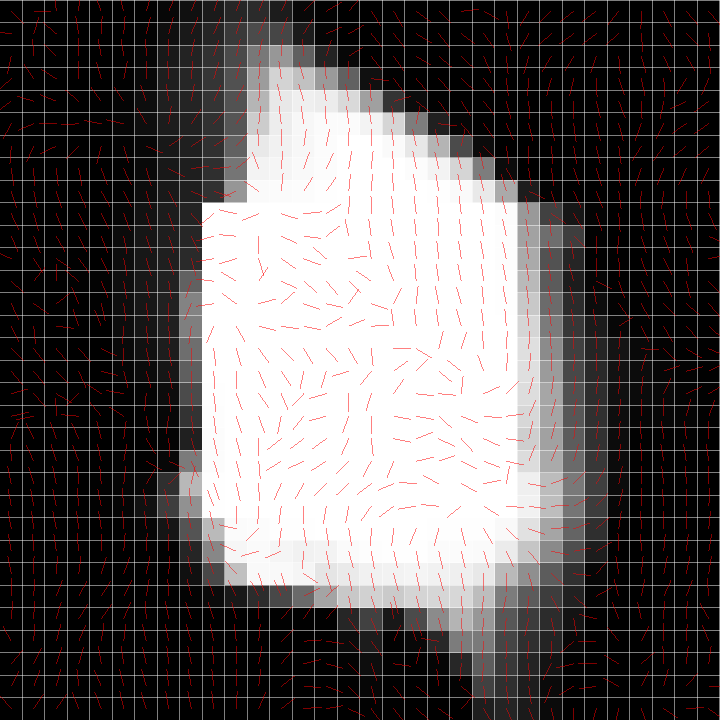

# Stable-Fluids
This is the implementation of *Stable Fluids* by Jos Stam at SIGGRAPH 1999.

FFT method with periodic boundary condition is one way to solve the equation of diffuse and projection faster.


## Build
**Windows is not supported.**
Libraries you need are
- Eigen
- FFTW (version 3)
- GLM
- GLFW

You can build and execute following command.

```shell
$ git clone https://github.com/daichi-ishida/Stable-Fluids.git
$ mkdir bin obj
$ make
$ ./bin/main
```

Density is continuously add to the initial area by default.
if you want to add density only once at the first, 
add `-o` command that represents for "once"

```shell
$ ./bin/main -o
```

## Screenshot

